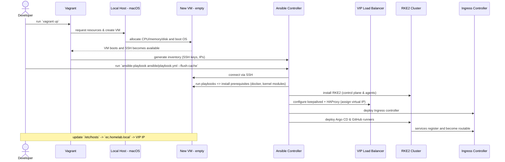

# Infrastructure (iac) — Combined Network Design & Lab README

This document merges the high-level network design and the Vagrant + Ansible lab README into a single place for the `iac-vagrant-k8s-cluster-local` repository.

Purpose
-------
Provide a single, opinionated source of truth for provisioning and operating a local RKE2 homelab cluster using Vagrant + Ansible. It includes:

- A request-path diagram (Mermaid) showing how user traffic flows.
- A provisioning sequence (how VMs are created and configured).
- Quick start and troubleshooting notes to help reproduce the environment.

Table of contents
-----------------
1. High-level network design (request path)
2. Provisioning sequence (how VMs are created & configured)
3. Quick start / Provisioning steps
4. Requirements & pre-install
5. Helm / app notes
6. Troubleshooting
7. References

This README focuses on practical, reproducible steps and diagrams. If you prefer split files (network-design.md + lab-README.md) say the word and I will split them.

## 🚀 Pre-requisites
- macOS (Apple Silicon supported)
- [VMware Fusion 13.5+](https://customerconnect.vmware.com/)
- [Vagrant](https://developer.hashicorp.com/vagrant/downloads)
- [Ansible](https://docs.ansible.com/ansible/latest/installation_guide/intro_installation.html)
- [Vagrant base image](https://portal.cloud.hashicorp.com/vagrant/discover?architectures=arm64&providers=%5B%22vmware_fusion%22%2C%22vmware_desktop%22%5D&query=ubuntu)

## 1) High-level Network Design (request path)

The following Mermaid diagram shows the request path (how a user request travels) for a local homelab Kubernetes cluster provisioned with Vagrant and Ansible.

```mermaid
flowchart LR
  User[User]
  Domain[ec.homelab.local]
  User --> Domain
  Domain -->|resolves via /etc/hosts -> VIP IP| VIP[VIP Load Balancer VM]
  VIP --> HA[Keepalived + HAProxy]
  HA --> Ingress[Ingress Controller]
  Ingress --> Cluster[Cluster: RKE2]

  subgraph Cluster
    Master[RKE2 Control Plane\nmaster]
    Worker1[Worker Node]
    Worker2[Worker Node]
    Front[JSF Frontend\npod / svc]
    Order[Order Service]
    Product[Product Service]
  end

  Ingress --> Front
  Front --> Order
  Front --> Product
  Order --> Product

  %% show where services run (workers)
  Front -->|runs on workers| Worker1
  Order -->|runs on workers| Worker2
  Product -->|runs on workers| Worker2

  style User fill:#FFF3E0,stroke:#333
  style Domain fill:#FFE0B2,stroke:#333
  style VIP fill:#E53935,stroke:#333
  style HA fill:#D32F2F,stroke:#333
  style Ingress fill:#1976D2,stroke:#333
  style Master fill:#263238,stroke:#fff
  style Worker1 fill:#2E7D32,stroke:#fff
  style Worker2 fill:#2E7D32,stroke:#fff
  style Front fill:#FF8F00,stroke:#333
  style Order fill:#E53935,stroke:#333
  style Product fill:#1976D2,stroke:#333
```



Short explanation (request flow):
- A user accesses the cluster via the domain `ec.homelab.local` (this domain should be added to your local `/etc/hosts` and point to the VIP IP for the load balancer).
- DNS/hosts resolution sends the request to the VIP Load Balancer VM. Keepalived provides the virtual IP and HAProxy forwards HTTP(S) traffic to the Ingress controller.
- The Ingress controller receives the HTTP request and routes it to the JSF frontend service running inside the RKE2 cluster (services typically run on worker nodes).
- The JSF frontend then calls two backend services: Order and Product. The Order service may itself call the Product service to fulfill requests.
- The cluster control plane (master) manages control-plane operations; actual request handling is done by pods on the worker nodes.
- Argo CD, GitHub Actions runners, and the internal registry integrate with this flow for CI/CD (build → push → Argo/CD deploy).

## 2) Provisioning sequence (how the VMs get created and configured)

The diagram below shows the typical provisioning flow when starting from nothing: Vagrant creates VMs, they boot, then Ansible connects and installs RKE2, keepalived/HAProxy, Ingress, Argo CD, and other components.



Short numbered steps:
1. On your developer machine run `vagrant up`.
2. Vagrant asks the host to create VMs; VMs boot with a minimal OS and SSH enabled.
3. Vagrant writes an Ansible inventory containing VM IPs and SSH keys.
4. Developer triggers Ansible with `ansible-playbook ...` to provision the machines.
5. Ansible connects to each VM over SSH and runs the configured playbooks.
6. Playbooks install dependencies and RKE2; control plane and worker nodes are initialized and joined.
7. Playbooks configure the VIP (keepalived) and HAProxy to expose the virtual IP.
8. Ingress controller, Argo CD, and runners are installed into the cluster.
9. Once provisioned, add `ec.homelab.local` to your local `/etc/hosts` pointing at the VIP IP to access the cluster through the load balancer.

## 3) Quick start / Provisioning steps

Quick start (minimal):

```bash
# 1. Bring up VMs
vagrant up

# 2. Verify connectivity
ansible all -m ping

# 3. Provision cluster (from repo root)
ansible-playbook ansible/playbook.yml --flush-cache
```

Verify cluster components:

```bash
kubectl get pods -n argocd
kubectl get svc -n ingress-nginx
```

Cleanup:

```bash
vagrant destroy -f
vagrant global-status --prune
vagrant box prune -f
rm -rf .vagrant/
```

## 4) Requirements & pre-install

### Requirements
- macOS (Apple Silicon supported)
- VMware Fusion 13.5+ (or another supported provider)
- Vagrant
- Ansible
- A suitable Vagrant base image for ARM64 (Ubuntu)

Recommended Homebrew install commands (macOS):

```bash
brew install --cask vagrant vmware-fusion
brew install ansible
vagrant plugin install vagrant-vmware-desktop
```

Install required Ansible collections:

```bash
ansible-galaxy collection install ansible.posix kubernetes.core
```

### Pre-installation (secrets)
- Configure your GitHub Personal Access Token (PAT) in `ansible/group_vars/master.yml` for the Actions Runner Controller:

```yaml
github_username: "your_github_username_here"
github_pat: "ghp_your_secret_token_here"
```

- Ensure SSH keys are available in `ssh_keys/` (the original repo contains `ssh_keys/id_rsa` and `id_rsa.pub`).

## 5) Helm / app notes

Render a template for debugging:

```bash
helm template vote-app-100 ./ -n vote-app -f values-dev.yml -s templates/deployment.yml
```

Install / upgrade:

```bash
helm install vote-app-100 ./ -n vote-app -f values-dev.yml
helm upgrade vote-app-100 ./ -n vote-app -f values-dev.yml
```

Debug / remove:

```bash
kubectl get pod -n vote-app -o wide
kubectl exec -it <pod> -n vote-app -- sh
helm uninstall vote-app-100 -n vote-app
kubectl delete all --all -n <namespace>
```

## 6) Troubleshooting (collected)

1. Vagrant + VMware utility TCP error on Apple Silicon

Issue:

```
Vagrant encountered an unexpected communications error with the
Vagrant VMware Utility driver. Failed to open TCP connection to 127.0.0.1:9922
```

Quick fix:

```bash
sudo rm -rf /opt/vagrant-vmware-desktop
sudo rm /Library/LaunchDaemons/com.hashicorp.vagrant-vmware-utility.plist
# Reinstall the VMware Utility (download arm64 utility from HashiCorp)
vagrant plugin uninstall vagrant-vmware-desktop
vagrant plugin install vagrant-vmware-desktop
```

2. CNI / pod sandbox network setup error (Calico/Canal)

Issue:

```
Failed to create pod sandbox: plugin type="calico" failed (add): error getting ClusterInformation: connection is unauthorized: Unauthorized
```

Tip:

```bash
kubectl delete pod -n kube-system -l k8s-app=canal
```

## 7) References

- Original network design (Vietnamese): `.github/docs/network-design.md`
- Original lab README: `iac-vagrant-k8s-cluster-local/README.md` (merged)

---

If you'd like, I can:
- Split this into separate files under `iac/` (e.g., `network-design.md`, `provisioning.md`).
- Render the Mermaid diagrams to SVG and attach them to the repo for consistent GitHub display.

*** End Patch

