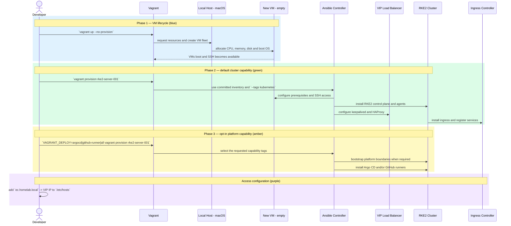

# Infrastructure (iac) — Combined Network Design & Lab README

This document merges the high-level network design and the Vagrant + Ansible lab README into a single place for the `iac-vagrant-k8s-cluster-local` repository.

Purpose
-------
Provide a single, opinionated source of truth for provisioning and operating a local RKE2 homelab cluster using Vagrant + Ansible. It includes:

- A request-path diagram (Mermaid) showing how user traffic flows.
- A provisioning sequence (how VMs are created and configured).
- Quick start and troubleshooting notes to help reproduce the environment.

Table of contents
-----------------
1. High-level network design (request path)
2. Provisioning sequence (how VMs are created & configured)
3. Quick start / Provisioning steps
4. Requirements & pre-install
5. Helm / app notes
6. Troubleshooting
7. References

This README focuses on practical, reproducible steps and diagrams. If you prefer split files (network-design.md + lab-README.md) say the word and I will split them.

## 🚀 Pre-requisites
- macOS (Apple Silicon supported)
- [VMware Fusion 13.5+](https://customerconnect.vmware.com/)
- [Vagrant](https://developer.hashicorp.com/vagrant/downloads)
- [Ansible](https://docs.ansible.com/ansible/latest/installation_guide/intro_installation.html)
- [Vagrant base image](https://portal.cloud.hashicorp.com/vagrant/discover?architectures=arm64&providers=%5B%22vmware_fusion%22%2C%22vmware_desktop%22%5D&query=ubuntu)

## 1) High-level Network Design (request path)

The following Mermaid diagram shows the request path (how a user request travels) for a local homelab Kubernetes cluster provisioned with Vagrant and Ansible.

```mermaid
flowchart LR
  User[User]
  Domain[ec.homelab.local]
  User --> Domain
  Domain -->|resolves via /etc/hosts -> VIP IP| VIP[VIP Load Balancer VM]
  VIP --> HA[Keepalived + HAProxy]
  HA --> Ingress[Ingress Controller]
  Ingress --> Cluster[Cluster: RKE2]

  subgraph Cluster
    Master[RKE2 Control Plane\nmaster]
    Worker1[Worker Node]
    Worker2[Worker Node]
    Front[JSF Frontend\npod / svc]
    Order[Order Service]
    Product[Product Service]
  end

  Ingress --> Front
  Front --> Order
  Front --> Product
  Order --> Product

  %% show where services run (workers)
  Front -->|runs on workers| Worker1
  Order -->|runs on workers| Worker2
  Product -->|runs on workers| Worker2

  style User fill:#FFF3E0,stroke:#333
  style Domain fill:#FFE0B2,stroke:#333
  style VIP fill:#E53935,stroke:#333
  style HA fill:#D32F2F,stroke:#333
  style Ingress fill:#1976D2,stroke:#333
  style Master fill:#263238,stroke:#fff
  style Worker1 fill:#2E7D32,stroke:#fff
  style Worker2 fill:#2E7D32,stroke:#fff
  style Front fill:#FF8F00,stroke:#333
  style Order fill:#E53935,stroke:#333
  style Product fill:#1976D2,stroke:#333
```



Short explanation (request flow):
- A user accesses the cluster via the domain `ec.homelab.local` (this domain should be added to your local `/etc/hosts` and point to the VIP IP for the load balancer).
- DNS/hosts resolution sends the request to the VIP Load Balancer VM. Keepalived provides the virtual IP and HAProxy forwards HTTP(S) traffic to the Ingress controller.
- The Ingress controller receives the HTTP request and routes it to the JSF frontend service running inside the RKE2 cluster (services typically run on worker nodes).
- The JSF frontend then calls two backend services: Order and Product. The Order service may itself call the Product service to fulfill requests.
- The cluster control plane (master) manages control-plane operations; actual request handling is done by pods on the worker nodes.
- Argo CD, GitHub Actions runners, and the internal registry integrate with this flow for CI/CD (build → push → Argo/CD deploy).

## 2) Provisioning sequence (how the VMs get created and configured)

The diagram below shows the provisioning flow from an empty machine. It uses
coloured phases so the VM lifecycle, default cluster deployment, and optional
platform add-ons are easy to distinguish.



Short numbered steps:
1. Run `vagrant up --no-provision` so every VM is SSH-ready before cluster provisioning starts.
2. Run `vagrant provision rke2-server-001`; `VAGRANT_DEPLOY` defaults to `cluster` and selects only the RKE2 control plane, agents, and VIP load balancer.
3. Ansible connects with the committed inventory, installs RKE2, joins workers, and configures keepalived/HAProxy.
4. Opt into add-ons only when needed: `VAGRANT_DEPLOY=argocd`, `VAGRANT_DEPLOY=github-runner`, or `VAGRANT_DEPLOY=all`.
5. Add `ec.homelab.local` to local `/etc/hosts`, pointing to the VIP IP, to access ingress-routed services.

## 3) Quick start / Provisioning steps

Quick start (minimal; default deploys only the RKE2 cluster):

```bash
# 1. Bring up the whole VM fleet before Ansible touches the cluster
vagrant up --no-provision

# 2. Verify connectivity
ansible all -m ping

# 3. Provision the default cluster capability
vagrant provision rke2-server-001
```

Choose an opt-in capability with `VAGRANT_DEPLOY`. `argocd` and
`github-runner` include platform bootstrap first; `all` runs the complete
playbook:

```bash
VAGRANT_DEPLOY=platform-bootstrap vagrant provision rke2-server-001
VAGRANT_DEPLOY=argocd vagrant provision rke2-server-001
VAGRANT_DEPLOY=github-runner vagrant provision rke2-server-001
VAGRANT_DEPLOY=all vagrant provision rke2-server-001
```

Available values: `cluster` (default), `platform-bootstrap`, `argocd`,
`github-runner`, and `all`. Rancher is not yet a repository capability: no
Rancher Ansible role or manifest exists, so it is intentionally not exposed as
a no-op option.

Application delivery is GitOps-only: runners build and update the repository, while
Argo CD is the only component allowed to reconcile application workloads. Runner
pods do not receive Kubernetes API tokens or RBAC permissions in application
namespaces.

Verify cluster components:

```bash
kubectl get pods -n argocd
kubectl get svc -n ingress-nginx
```

Cleanup:

```bash
vagrant destroy -f
vagrant global-status --prune
vagrant box prune -f
rm -rf .vagrant/
```

## 4) Requirements & pre-install

### Requirements
- macOS (Apple Silicon supported)
- VMware Fusion 13.5+ with the `vagrant-vmware-desktop` plugin
- Vagrant
- Ansible
- A suitable Vagrant base image for ARM64 (Ubuntu)

Recommended Homebrew install commands (macOS):

```bash
brew install --cask vagrant vmware-fusion
brew install ansible
vagrant plugin install vagrant-vmware-desktop
```

Install required Ansible collections:

```bash
ansible-galaxy collection install -r ansible/requirements.yml
```

### Pre-installation (secrets)
- Copy `ansible/group_vars/master.example.yml` to the ignored `ansible/group_vars/master.yml`, then set separate GitHub credentials for Actions Runner Controller and Argo CD. Prefer encrypting the file with Ansible Vault. The Argo CD token must be read-only and scoped only to the GitOps repository.

```yaml
github_username: "your_github_username_here"
arc_github_token: "replace_with_a_runner_registration_token"
argocd_repo_token: "replace_with_a_read_only_gitops_repository_token"
```

- Ensure your own SSH key pair is available as `ssh_keys/id_rsa` and `ssh_keys/id_rsa.pub`. The directory is ignored and no private key is committed.

## 5) Helm / app notes

Render a template for debugging:

```bash
helm template vote-app-100 ./ -n vote-app -f values-dev.yml -s templates/deployment.yml
```

Install / upgrade:

```bash
helm install vote-app-100 ./ -n vote-app -f values-dev.yml
helm upgrade vote-app-100 ./ -n vote-app -f values-dev.yml
```

Debug / remove:

```bash
kubectl get pod -n vote-app -o wide
kubectl exec -it <pod> -n vote-app -- sh
helm uninstall vote-app-100 -n vote-app
kubectl delete all --all -n <namespace>
```

## 6) Troubleshooting (collected)

1. Vagrant + VMware utility TCP error on Apple Silicon

Issue:

```
Vagrant encountered an unexpected communications error with the
Vagrant VMware Utility driver. Failed to open TCP connection to 127.0.0.1:9922
```

Quick fix:

```bash
sudo rm -rf /opt/vagrant-vmware-desktop
sudo rm /Library/LaunchDaemons/com.hashicorp.vagrant-vmware-utility.plist
# Reinstall the VMware Utility (download arm64 utility from HashiCorp)
vagrant plugin uninstall vagrant-vmware-desktop
vagrant plugin install vagrant-vmware-desktop
```

2. CNI / pod sandbox network setup error (Calico/Canal)

Issue:

```
Failed to create pod sandbox: plugin type="calico" failed (add): error getting ClusterInformation: connection is unauthorized: Unauthorized
```

Tip:

```bash
kubectl delete pod -n kube-system -l k8s-app=canal
```

## 7) Validation

Run the repository checks before provisioning or opening a pull request:

```bash
./scripts/validate.sh
```
