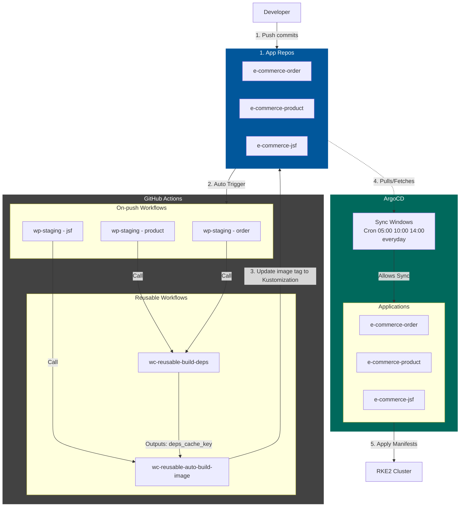
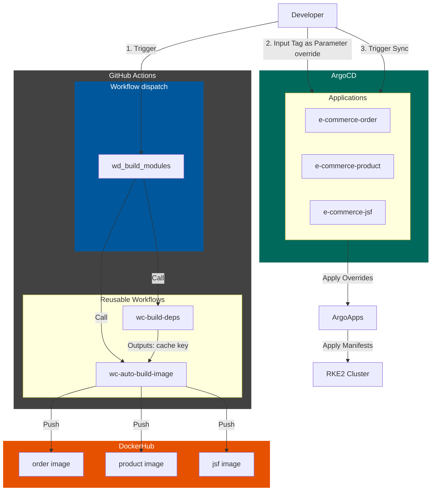
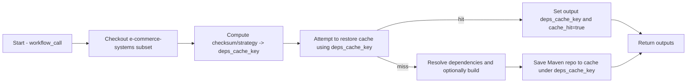
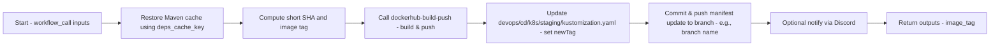
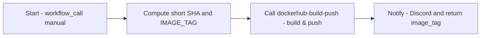
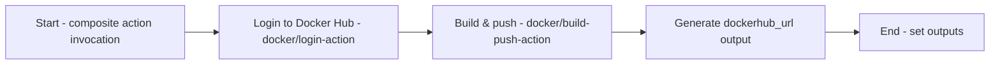
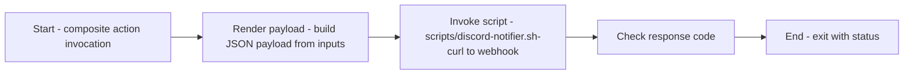
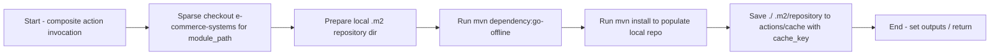
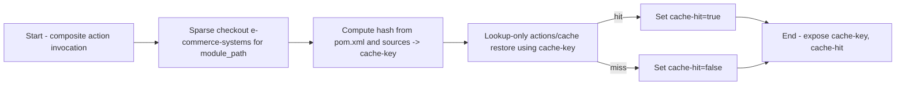

# GitHub Workflows & CI/CD Architecture — Deep Dive

This document provides a detailed explanation of the GitHub Actions system used across the entire workspace: triggers, reusable workflows, inputs/outputs, calling flows (caller → callee), and required variables/secrets. It not only describes the technical aspects but also provides guidance on the operational context and security rules.

## 1. System Overview (Quick Summary)

- **Number of workflow files (across repositories):** 10
  - `e-commerce-order-service`: `wp-staging-build-image.yml` (on: push), `wd-staging-build-image.yml` (on: workflow_dispatch)
  - `e-commerce-product-service`: same (push + dispatch)
  - `e-commerce-jsf-storefront`: same (push + dispatch)
  - `iac-vagrant-k8s-cluster-local`: `wc-reusable-auto-build-image.yml`, `wc-reusable-manual-build-image.yml`, `wc-reusable-build-deps.yml`, `build-modules.yml`

- **Reusable workflows (callable via `workflow_call`):** 3 (the `wc-reusable-*` files located in `iac-vagrant-k8s-cluster-local`)
- **Manual dispatch workflows:** 4 (each app has a `wd-*.yml`; the IaC repo has `build-modules.yml` for general testing/triggering)
- **Local composite/actions:** Located at `iac-vagrant-k8s-cluster-local/.github/actions/` including: `container-build-push`, `discord-notifier`, `build-deps`, `check-deps`.

## 2. Operational Context & Configuration

### 2.1. Branching Strategy & Environments

| Branch | Workflow file | Environment | Target Cluster | CD Action (ArgoCD) |
| :--- | :--- | :--- | :--- | :--- |
| `master` / `release/*` | `wp-staging-*.yml` | Staging | RKE2 (Local/Vagrant) | Auto-sync (based on Cron window) |
| Any (Manual) | `wd-staging-*.yml` | Staging | RKE2 (Local/Vagrant) | Manual Sync via UI |

### 2.2. Permissions, Security & Roadmap

These workflows require the following permissions at the Repository/Organization level:
- `contents: write`: Mandatory for the workflow that automatically updates the `kustomization.yaml` file to commit changes.
- **Secrets Management:** `DOCKER_USERNAME`, `DOCKER_PASSWORD`, and `DISCORD_WEBHOOK_URL` must be configured at the Organization Secrets level so that all repos can access them.
- **GCP Transition Roadmap:** The current system uses username/password for the registry. However, the actions (like `container-build-push`) have been designed with an open architecture to support migrating the entire on-premise infrastructure to Google Cloud Platform (GCP). In the upcoming phase, authentication will transition to a passwordless mechanism via **Workload Identity Federation (WIF)** to push images directly to Google Artifact Registry (GAR). At that time, the `id-token: write` permission must be added to the workflows.

### 2.3. Concurrency Control

To avoid resource wastage and commit conflicts when multiple developers push code simultaneously:
- Workflows use `concurrency: group: ${{ github.workflow }}-${{ github.ref }}` with the `cancel-in-progress: true` flag for PR/feature branch build runs.
- For the specific step of committing changes to `kustomization.yaml`, the execution will be queued sequentially to avoid Git conflicts.

### 2.4. Error Handling & Rollback

- **Failure Alert:** If a workflow fails at any step, the `discord-notifier` will send a RED notification (with a link to the run logs) to the DevOps channel.
- **Rollback:** In case an image is deployed to RKE2 but the Pod crashes (`CrashLoopBackOff`), the prioritized resolution process is: Open ArgoCD UI ➔ Select Application ➔ **Rollback** to the previous Revision (no need to wait for a CI rerun).

---

## 3. CI/CD Architecture Diagrams

### 3.1. Automation Flow (push → reusable workflows)

### 3.2. Manual workflow (developer-triggered dispatch, selective builds)

## 4. Per-workflow details (expanded)

The small flowcharts below describe internal steps inside each reusable workflow. They expand on the overview diagrams.

### 4.1 `wc-reusable-build-deps.yml` (callable)

- Location: `iac-vagrant-k8s-cluster-local/.github/workflows/wc-reusable-build-deps.yml`
- Trigger: `on: workflow_call`
- Purpose: compute a cache key for Maven dependencies, restore or publish a cache to speed downstream builds.
- Inputs:
  - `image_runtime` (string)
  - `module_path` (string)
- Outputs:
  - `deps_cache_key`
  - `cache_hit`

Flow (detailed):

Called-by: app push workflows such as `wp-staging-build-image.yml` in the app repos.

### 4.2 `wc-reusable-auto-build-image.yml` (callable)

- Location: `iac-vagrant-k8s-cluster-local/.github/workflows/wc-reusable-auto-build-image.yml`
- Trigger: `on: workflow_call`
- Purpose: restore caches, build & push Docker image, update kustomize manifest, and commit the manifest change.
- Inputs: `app_name`, `dockerfile_path`, `deps_cache_key`, `gha_environment`
- Required secrets: `DOCKER_USERNAME`, `DOCKER_PASSWORD`, `DISCORD_WEBHOOK_URL`

Flow (detailed):

Notes: Be careful with auto-commits as they may retrigger workflows; ensure the token used for commit has correct permissions and consider concurrency/grouping to avoid races.

### 4.3 `wc-reusable-manual-build-image.yml` (callable)

- Location: `iac-vagrant-k8s-cluster-local/.github/workflows/wc-reusable-manual-build-image.yml`
- Trigger: `on: workflow_call`
- Purpose: manual image build & push when invoked from a dispatch workflow (does not always auto-update manifests).
- Inputs: `app_name`, `dockerfile_path`, `gha_environment`
- Required secrets: `DOCKER_USERNAME`, `DOCKER_PASSWORD`, `DISCORD_WEBHOOK_URL` (note: the workflow reference `GIHUB_PAT` in places — likely should be `GITHUB_PAT`).

Flow (detailed):

Called-by: app dispatch workflows such as `wd-staging-build-image.yml` in the app repos.

## Local composite actions (in-repo)

The repository provides several in-repo composite actions under `.github/actions/`. These are used by the reusable workflows above. Below are their paths, inputs/outputs and a short description of the steps they perform.

### `dockerhub-build-push` — .github/actions/dockerhub-build-push

- Purpose: Build a Docker image and push to Docker Hub (via docker/build-push-action) and generate a direct Docker Hub URL for the pushed tag.
- Path: `iac-vagrant-k8s-cluster-local/.github/actions/dockerhub-build-push/action.yml`
- Inputs:
  - `docker_username` (required) — Docker Hub username
  - `docker_password` (required) — Docker Hub password
  - `image_name` (required) — name of the image
  - `image_tag` (optional, default: `latest`) — tag
  - `dockerfile_path` (optional, default: `./Dockerfile`)
  - `docker_push` (optional, default: `true`) — whether to push
  - `context` (optional, default: `.`) — build context
- Outputs:
  - `dockerhub_url` — URL to the image tag on Docker Hub (from step output)
- Steps summary:
  - Login to Docker Hub via `docker/login-action`
  - Build and push image using `docker/build-push-action`
  - Generate a Docker Hub URL and expose it as output

Flowchart (internal steps):

### `discord-notifier` — .github/actions/discord-notifier

- Purpose: Send formatted Discord notifications (used to report start/result of builds).
- Path: `iac-vagrant-k8s-cluster-local/.github/actions/discord-notifier/action.yml`
- Inputs:
  - `webhook_url` (required) — Discord webhook URL
  - `status` (required) — job status (for color coding)
  - `title` (required) — title of the notification
  - `message` (required) — main content
- Steps summary:
  - Runs a small shell script (`scripts/discord-notifier.sh`) with the provided inputs to post a message to Discord

Flowchart (internal steps):

### `build-deps` — .github/actions/build-deps

- Purpose: Resolve Maven dependencies for a module and save the Maven repo into the cache (used on cache miss).
- Path: `iac-vagrant-k8s-cluster-local/.github/actions/build-deps/action.yml`
- Inputs:
  - `module_path` (required) — path to the module inside `e-commerce-systems` (e.g., `common-deps`)
  - `cache_key` (required) — cache key computed by the `check-deps` action
- Steps summary:
  - Checkout the `e-commerce-systems` repo using sparse checkout for the specified `module_path`
  - Run `mvn dependency:go-offline` and `mvn install` with a local maven repo under `./.m2/repository`
  - Save `./.m2/repository` to the actions cache using the provided `cache_key`

Flowchart (internal steps):

### `check-deps` — .github/actions/check-deps

- Purpose: Compute a stable cache key for a module and perform a lookup-only cache restore to determine if the Maven cache exists.
- Path: `iac-vagrant-k8s-cluster-local/.github/actions/check-deps/action.yml`
- Inputs:
  - `module_path` (required) — path to the module inside `e-commerce-systems`
- Outputs:
  - `cache-key` — computed cache key suitable for actions/cache
  - `cache-hit` — whether the cache existed (lookup-only restore step result)
- Steps summary:
  - Checkout `e-commerce-systems` with sparse checkout for `module_path`
  - Compute a hash from `pom.xml` (and/or sources) and expose it as `cache-key`
  - Use `actions/cache/restore` in lookup-only mode to set `cache-hit`

Flowchart (internal steps):

